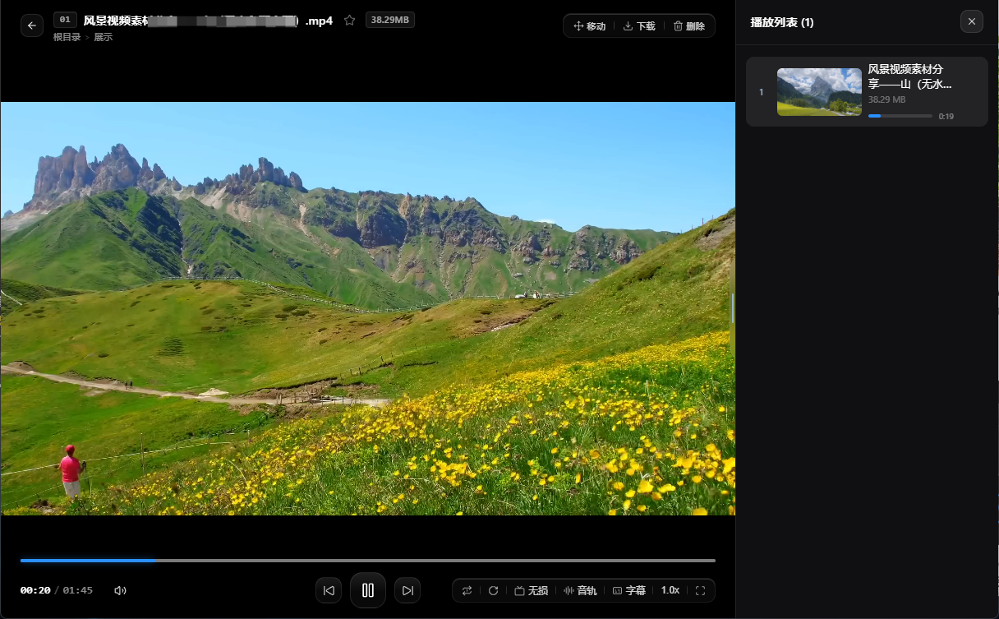
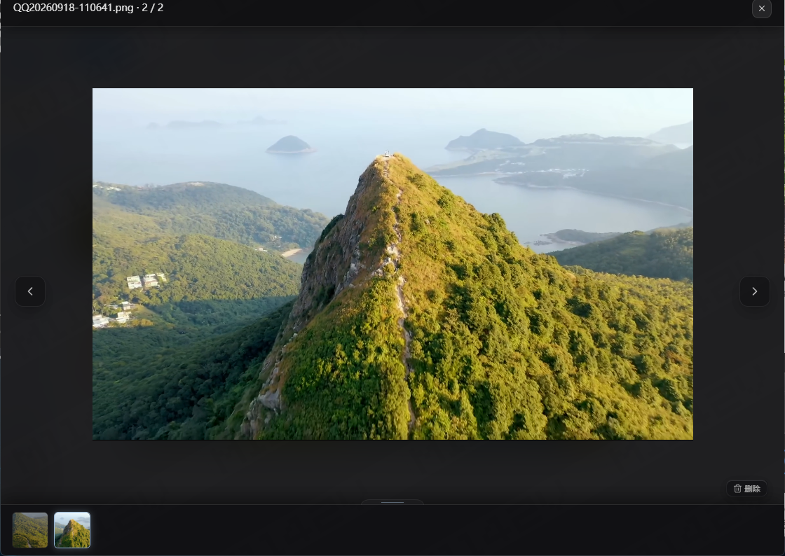

# 115m

<p align="center">
  
</p>

<h3 align="center">115 网盘现代流媒体播放器与全屏多媒体增强套件</h3>

<p align="center">
  
  
  
  
  
</p>

<p align="center">
  <b>115m</b> 是一款专为 115 网盘打造的开源 Chrome 前端体验增强扩展。<br />
  采用现代工业级流媒体底座彻底重构播放器，统一中性炭黑与黑曜石极光设计语言，带来原画秒开、毫秒级抽帧预览与沉浸式全屏视效。
</p>

---

## 视觉盛宴与界面预览

<div align="center">
  <h3>🎬 2.0 现代影院级黑曜石极光播放器</h3>
  <p>Vidstack 工业底座驱动 · 居中超椭圆控制群 · 时间轨悬停微秒级抽帧缩略图</p>
  
</div>

<br />

<div align="center">
  <h3>🖼️ 顶级视口沉浸大图查看器</h3>
  <p>穿透顶层视口真全屏 · 无滚动条 · 滚轮自适应平滑缩放 · 底部缩略图胶卷避让</p>
  
</div>

---

## 核心特性

### 1. 现代工业级流媒体播放体系（Player Core）

- **工业级 Vidstack 流媒体底座**：彻底告别老旧补丁框架，具备纯净硬件加速管线，原生支持高码率原画直连与 HLS 转码流秒开播放。
- **黑曜石极光设计语言（Obsidian Aurora）**：基于 Design Tokens 全局令牌驱动，深空炭黑毛玻璃质感、超椭圆中轴控制群与纤薄翼根感应侧键。
- **WebCodecs 硬件抽帧悬停预览**：进度条鼠标悬停集成微秒级缩略图预览，常驻解码会话复用与批量渐进预热，按视频真实比例自适应尺寸，指哪出哪。
- **长按 2.0x 极速快进**：视频画面长按即刻无缝触发 2.0x 极速快进与柔光动态流光指示器，松手即刻恢复原速，全屏观影更从容。
- **画面点击与右键物理监控面板**：点击画面智能切换播放/暂停（边缘避让防误触）；支持右键呼出母带级实时分辨率、帧率与丢帧率监测面板。
- **全格式外挂/内嵌字幕解析**：深度支持 SRT、VTT、ASS、SUB 全格式字幕实时解析与内嵌渲染，支持同名目录自动匹配与自由切换。
- **清晰度全集与多音轨自由切换**：自动枚举并无缝切换原画及各档清晰度；支持原生多音轨与多声道音轨自由选择。
- **115 云端历史双向同步**：播放进度实时与 115 官方云端历史双向同步，智能节流回存与毫秒级断点续播。
- **播放内沉浸文件管理**：无需退出播放器即可直接呼出目录树弹窗移动文件、一键下载原画直链、收藏视频或删除连播下一集。

### 2. 全屏沉浸式大图查看器（PhotoSwipe v5 架构）

- **穿透挂载顶级视口**：突破 115 局部 iframe 与固定宽度截断限制，直达顶层真实视口，实现无滚动条的真全屏浏览。
- **极简中性炭黑晶体 UI**：纯净 Flex 弹性几何自适应居中，右上角轻透关闭键，右下角黑曜石微透删除胶囊。
- **双击往返与滚轮平滑缩放**：1x 状态下滚轮快速切图，双击放大后滚轮转为自适应无级缩放，贴近 1x 自动吸附复位。
- **底部自适应防遮挡胶卷**：底部缩略图胶卷展开时视口保留 84px 安全净空，大图自然避让压缩，绝不遮挡任何画面。

### 3. 网盘列表与浏览增强（Media Wall & Pro Tools）

- **文件夹封面卡片**：列表页智能提取并渲染媒体封面，查找分类更一目了然。
- **列表瀑布流图片聚合**：目录内图片聚合缩略图直观排布，支持框选与批量操作。
- **VIP 转码快捷加速**：针对具有官方 VIP 权益的用户，在文件列表预览区提供一键批量提交转码加速，告别反复进入播放器。
- **云端智能解压联动**：调用官方云端解压能力，支持一键解压至同名目录与多选批量解压。
- **纯净侧边栏定制**：支持自由配置与隐藏无用模块，打造专注高效的个人网盘空间。

---

## 快捷键速查表

在视频播放器内，支持全键盘盲操快捷键：

| 按键 | 功能说明 |
|:---|:---|
| **Space** / **K** | 播放 / 暂停 |
| **←** / **→** | 快退 5 秒 / 快进 5 秒 |
| **↑** / **↓** | 音量调节（步进 10%） |
| **M** | 快速静音 / 取消静音 |
| **F** | 进入 / 退出全屏播放 |
| **R** | 画面顺时针旋转 90° |
| **[** / **]** | 切换上一集 / 切换下一集 |
| **画面长按** | 2.0x 极速快进（松手恢复正常倍速） |
| **画面单击** | 播放 / 暂停（排除交互控件区域） |
| **画面右键** | 唤起实时性能与视频规格监视面板 |

---

## 安全声明与合规准则

1. **纯粹前端交互增强**：本项目为独立开源的前端体验与交互优化工具，所有功能均基于用户自身已有的 115 账号权限运行，**绝不包含任何越权、破解或绕过付费机制的功能**（例如“VIP 转码加速”仅为已有官方会员权益的用户提供操作通道，无会员权限无法使用）。
2. **非官方合作声明**：本项目为第三方开源项目，与 115 官方无任何隶属、赞助或商业合作关系。
3. **隐私安全零外发**：代码 100% 在用户本地浏览器环境运行，不设立任何外部服务器，绝不收集、记录或上传任何用户数据、Cookie 或隐私信息。

---

## 安装与使用

本项目未上架应用商店，推荐通过 Chrome 开发者模式加载使用：

### 推荐方式：下载预编译版本（适合普通用户）

1. 前往本仓库的 **[Releases 页面](../../releases)** 下载最新版本的发布压缩包（如 `115m-v2.0.0.zip`）；
2. 解压至本地固定目录（请勿解压在临时目录，安装后需长期保留该文件夹）；
3. 打开 Chrome 浏览器，访问：`chrome://extensions/`；
4. 开启页面右上角的 **开发者模式** 开关；
5. 点击左上角 **加载已解压的扩展程序**；
6. 选择解压出的扩展产物目录（包含 `manifest.json` 的目录）即可完成安装。

**版本更新**：下载新版压缩包覆盖原文件夹，随后在扩展管理面板点击对应卡片的「重新加载」按钮即可。

### 开发者方式：从源码自行构建

```bash
# 1. 克隆代码仓库
git clone https://github.com/qh775885/115m.git
cd 115m

# 2. 安装依赖 (统一强制使用 pnpm)
pnpm install

# 3. 运行代码质检与自动化测试
pnpm check

# 4. 构建生产环境产物 (Chrome MV3)
pnpm build
```

构建完成后，将 `dist/chrome-mv3` 目录加载进 Chrome 即可。

---

## 权限说明

本项目严格遵循权限最小化原则，申请的权限仅用于实现核心用户体验：

| 权限标识 | 用途说明 |
|:---|:---|
| `storage` / `unlimitedStorage` | 用于在本地存储画质偏好、音量设置以及抽帧缩略图本地缓存 |
| `cookies` | 用于携带当前网盘会话凭证拉取媒体流，绝不外发第三方 |
| `downloads` | 用于将解析的原画直链转交浏览器原生下载器 |
| `scripting` / `webNavigation` / `tabs` | 仅在 115 官方网盘域名内挂载 UI 增强组件并监听视频路由 |

---

## 致谢与开源协议

本项目基于 **[GPL-3.0](LICENSE)** 协议开源。

特别鸣谢以下优秀开源项目与社区贡献者提供的技术参考与灵感思路：
- **[Vidstack](https://github.com/vidstack/player)**：提供现代工业级流媒体播放底座与标准 Web Components 体系
- **[PhotoSwipe](https://github.com/dimsemenov/PhotoSwipe)**：提供轻量流畅的 JavaScript 大图触摸交互范式
- **[115master](https://github.com/cbingb666/115master)**：提供了播放器早期的基础设计思路与架构参考
- **[115-魔改](https://sleazyfork.org/zh-CN/scripts/560291-115-%E9%AD%94%E6%94%B9)**：提供了部分网盘网页交互优化灵感
- **[nap511](https://github.com/zerorooot/nap511)**：提供了在线解压调度的参考方案

**特别说明**：项目作者不懂编程，项目代码主要由 AI 按需求协助全流程开发与工程化维护。欢迎社区提出宝贵建议并提交 Pull Request！
